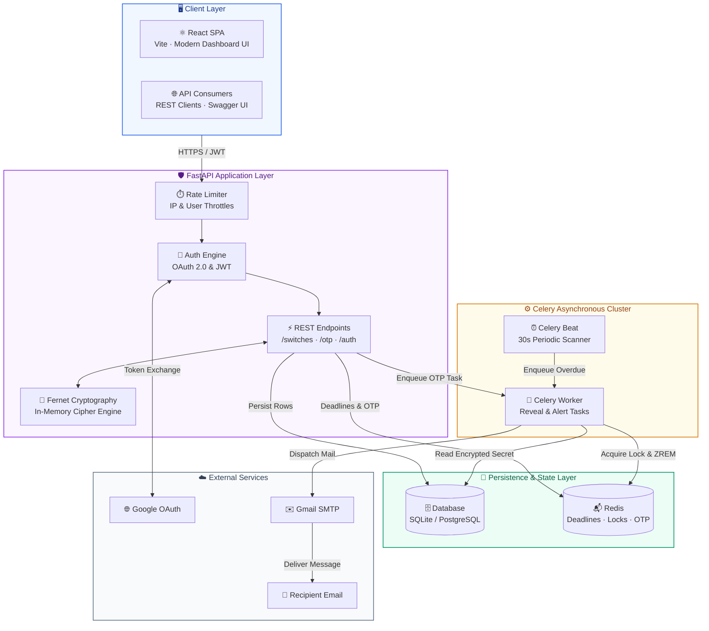
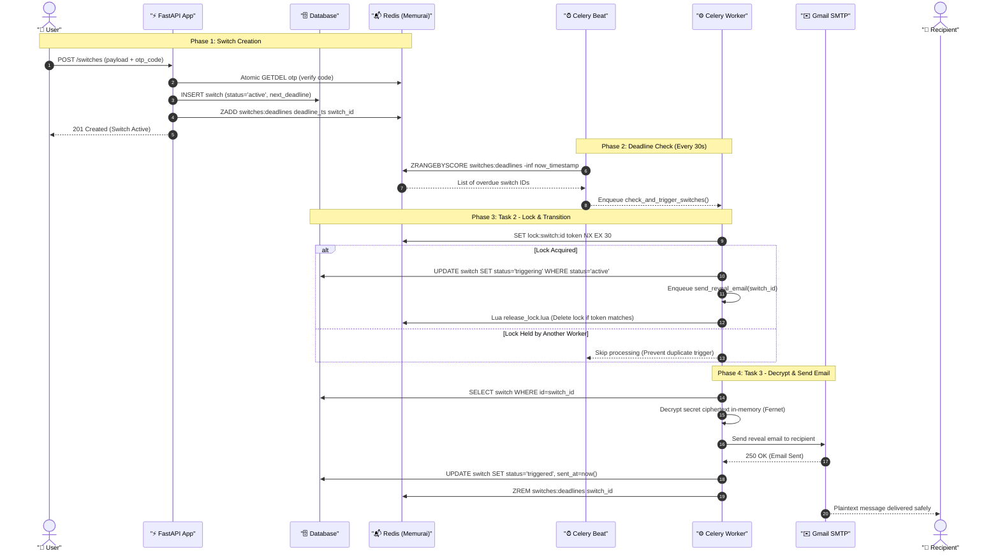
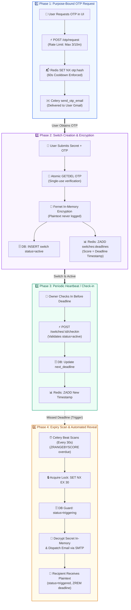
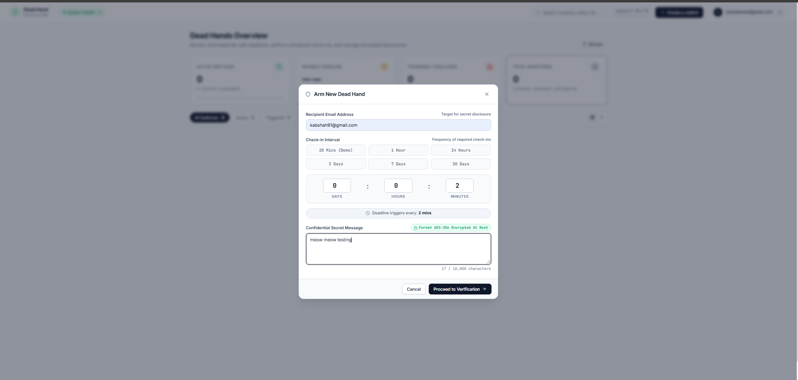
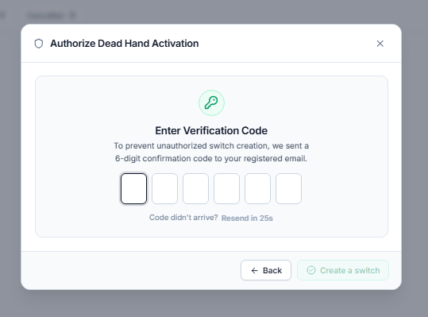
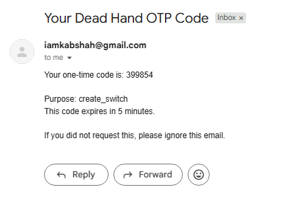
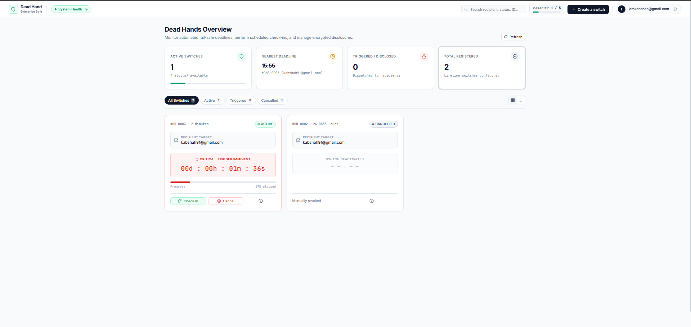
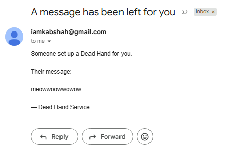

# Dead Man's Switch 

## Stack

| Component | Choice |
|---|---|
| Frontend | React 19 + Vite + Lucide Icons |
| Backend API | FastAPI (async) + Uvicorn |
| DB | SQLite |
| Auth | Google OAuth2 (Authlib) + JWT access/refresh tokens |
| OTP | Email (SMTP) + Redis NX storage + GETDEL atomicity |
| Cache / Rate-limit / Lock | Redis (Memurai on Windows / Redis on Linux/macOS) |
| Background jobs | Celery + Celery Beat + Celery Flower (`--pool=solo` on Windows) |
| Encryption | Fernet (`cryptography`) — at rest encryption |
| Package manager | uv (Python) + npm (Frontend) |

---

## 🚀 1-Command Docker Quickstart (Recommended)

Run the entire application stack (**React Frontend + FastAPI Backend + Celery Worker + Celery Beat + Redis + PostgreSQL + Flower Dashboard**) with a single command from one terminal:

```bash
docker compose up --build
```
*(Or in detached mode: `docker compose up -d --build`)*

### Service URLs:
- **React Frontend**: [http://localhost:5173](http://localhost:5173)
- **FastAPI Backend (Swagger Docs)**: [http://localhost:8000/docs](http://localhost:8000/docs)
- **Celery Flower Dashboard**: [http://localhost:5555](http://localhost:5555)

### Stop All Services:
```bash
docker compose down
```

---

## Manual Local Setup Guide (Step-by-Step)

### Step 1: Clone the Repository

```bash
git clone <YOUR_GIT_REPO_URL>
cd "dead switch"
```

---

### Step 2: Backend Installation & Setup (FastAPI)

1. **Install all Python dependencies**:
   ```bash
   uv sync
   ```
   *(This automatically creates the `.venv` virtual environment and installs all packages defined in `pyproject.toml`)*

2. **Configure environment variables (`.env`)**:
   ```bash
   # Windows:
   copy .env.example .env

   # Linux / macOS:
   cp .env.example .env
   ```

3. **Generate a Fernet Encryption Key** and paste it into `FERNET_KEY` in your `.env`:
   ```bash
   uv run python -c "from cryptography.fernet import Fernet; print(Fernet.generate_key().decode())"
   ```

4. **Fill in required `.env` values**:
   - `GOOGLE_CLIENT_ID` & `GOOGLE_CLIENT_SECRET`: From Google Cloud Console (OAuth 2.0 Client Credentials with Authorized redirect URI: `http://localhost:8000/auth/callback`).
   - `SMTP_USER` & `SMTP_PASSWORD`: Your email and Gmail App Password for sending OTPs and reveal emails.
   - `SMTP_FROM`: Sender email address (e.g. your Gmail).
   - `JWT_SECRET`: Any long random secret string.
   - `DATABASE_URL`: Defaults to `sqlite+aiosqlite:///./deadswitch.db` (zero database server configuration needed).

5. **Run Database Migrations**:
   ```bash
   uv run alembic upgrade head
   ```
   *(This creates all tables including `users`, `switches`, and `otp_attempts` in SQLite/Postgres)*

---

### Step 3: Frontend Installation & Setup (React + Vite)

Open a terminal or navigate into the `frontend` folder to install UI dependencies:

```bash
cd frontend
npm install
cd ..
```

---

### Step 4: Running the Application

1. **Start Backend API (Terminal 1)**:
   ```bash
   .venv\Scripts\Activate.ps1
   uv run uvicorn app.main:app --reload
   ```
   - Swagger Docs: http://localhost:8000/docs
   - Login Direct: http://localhost:8000/auth/login

2. **Start Frontend Dev Server (Terminal 2)**:
   ```bash
   cd frontend
   npm run dev
   ```
   - UI Dashboard: http://localhost:5173

3. **Start Celery Worker (Terminal 3)**:
   ```bash
   uv run celery -A app.tasks.celery_app worker --pool=solo --loglevel=info
   ```

4. **Start Celery Beat Scheduler (Terminal 4)**:
   ```bash
   uv run celery -A app.tasks.celery_app beat --loglevel=info
   ```

5. **Start Celery Flower Web Dashboard (Terminal 5 - Optional)**:
   ```bash
   uv run celery -A app.tasks.celery_app flower --port=5555
   ```
   - Flower UI: http://localhost:5555

---

## ☸️ Kubernetes & Helm Local Deployment (Minikube)

The project includes a production-ready Helm chart (`deadHand/`) to orchestrate the entire Dead Man's Switch infrastructure on a local Kubernetes cluster (Minikube or MicroK8s).

### 🏛️ Cluster Topology & Components

When deployed, the chart provisions 7 coordinated workloads:

| Component | Workload Type | Port / Internal DNS | Role |
|---|---|---|---|
| **PostgreSQL 16** | Deployment + PVC (`1Gi`) | `db:5432` | Primary ACID relational database with persistent storage |
| **Redis 7** | Deployment + PVC (`500Mi`) | `redis:6379` | Deadline sorted sets, distributed lock manager & OTP cache |
| **FastAPI Backend** | Deployment + ClusterIP | `backend:8000` | REST API, auto Alembic migrations via init container, Fernet encryption |
| **React Frontend** | Deployment + NodePort | `deadhand-frontend:5173` (NodePort: `30173`) | React 19 UI with embedded Nginx reverse proxy routing API calls |
| **Celery Worker** | Deployment | Background Worker | Asynchronous tasks, deadline reveal execution, and email delivery |
| **Celery Beat** | Deployment | Scheduler | Periodic deadline scanner (runs every 30s) |
| **Celery Flower** | Deployment + NodePort | `deadhand-flower:5555` (NodePort: `30555`) | Real-time monitoring and task inspection dashboard |

---

### 📋 Prerequisites

Ensure the following CLI tools are installed on your machine:
- **Docker Desktop** (or Docker Engine)
- **Minikube** (`minikube version`)
- **kubectl** (`kubectl version --client`)
- **Helm v3** (`helm version`)

---

### 🚀 Step-by-Step Deployment Guide

#### Step 1: Start Minikube Cluster
Start your local Minikube cluster using either the Hyper-V or Docker driver:

```powershell
# Using Hyper-V driver (Windows):
minikube start --driver=hyperv

# OR using Docker driver (cross-platform):
minikube start --driver=docker
```

Verify that the cluster node is ready:
```powershell
kubectl get nodes
```

#### Step 2: Build & Load Docker Images into Minikube
Since Minikube runs inside its own isolated VM/container runtime, build the images on your host and load them into Minikube's local cache:

```powershell
# 1. Build local container images
docker compose build

# 2. Load images into Minikube containerd cache
minikube image load deadswitch-backend:latest
minikube image load deadswitch-frontend:latest
minikube image load postgres:16-alpine
minikube image load redis:7-alpine
```

#### Step 3: Lint & Deploy with Helm
From the repository root directory, lint and deploy the `deadHand` chart:

```powershell
# Verify chart syntax
helm lint ./deadHand

# Deploy or upgrade the release
helm upgrade --install deadhand ./deadHand
```

#### Step 4: Verify Deployment Status
Check that all 7 pods transition to `Running` and `Ready` (1/1):

```powershell
kubectl get pods -l app.kubernetes.io/instance=deadhand
```

Expected output:
```text
NAME                                 READY   STATUS    RESTARTS   AGE
deadhand-backend-xxxxxxxxxx-xxxxx    1/1     Running   0          2m
deadhand-beat-xxxxxxxxxx-xxxxx       1/1     Running   0          2m
deadhand-flower-xxxxxxxxxx-xxxxx     1/1     Running   0          2m
deadhand-frontend-xxxxxxxxxx-xxxxx   1/1     Running   0          2m
deadhand-postgres-xxxxxxxxxx-xxxxx   1/1     Running   0          2m
deadhand-redis-xxxxxxxxxx-xxxxx      1/1     Running   0          2m
deadhand-worker-xxxxxxxxxx-xxxxx     1/1     Running   0          2m
```

---

### 🌐 Accessing the Application

#### Option A: Direct Minikube Browser Command
Run the following commands in your terminal to automatically open the services in your default browser:

```powershell
# Open React Frontend
minikube service deadhand-frontend

# Open Celery Flower Dashboard
minikube service deadhand-flower

# View all exposed cluster endpoints
minikube service list
```

#### Option B: Port-Forwarding to Localhost (Recommended for OAuth)
Because Google OAuth redirects to `http://localhost:8000/auth/callback` and `http://localhost:5173`, forwarding the ports to `localhost` ensures seamless Google authentication:

```powershell
# Terminal 1: Forward Frontend
kubectl port-forward svc/deadhand-frontend 5173:5173

# Terminal 2: Forward Backend (Required for Google OAuth login flow)
kubectl port-forward svc/backend 8000:8000

# Terminal 3: Forward Celery Flower (Optional)
kubectl port-forward svc/deadhand-flower 5555:5555
```

| Service | Local Endpoint | Description |
|---|---|---|
| **React Frontend** | [http://localhost:5173](http://localhost:5173) | Main user interface |
| **Backend Swagger Docs** | [http://localhost:8000/docs](http://localhost:8000/docs) (or [http://localhost:5173/docs](http://localhost:5173/docs)) | Interactive API documentation |
| **API Health Check** | [http://localhost:8000/health](http://localhost:8000/health) | Healthcheck endpoint (`{"status":"ok"}`) |
| **Celery Flower** | [http://localhost:5555](http://localhost:5555) | Celery task inspection UI |

---

### 🛠️ Useful Debugging & Operations Commands

```powershell
# Inspect backend logs (including Alembic auto-migrations):
kubectl logs -f deployment/deadhand-backend -c backend

# Inspect Celery worker task execution logs:
kubectl logs -f deployment/deadhand-worker -c celery-worker

# Inspect Celery beat scheduler logs:
kubectl logs -f deployment/deadhand-beat -c celery-beat

# Connect to PostgreSQL directly:
kubectl exec -it deployment/deadhand-postgres -- psql -U postgres -d deadswitch

# Connect to Redis CLI:
kubectl exec -it deployment/deadhand-redis -- redis-cli

# Teardown the Helm deployment (deletes pods, services, deployments):
helm uninstall deadhand
```

---

## Run tests

```bash
uv run pytest tests/ -v
```

All 20 tests run without a live DB or Redis (uses fakeredis).


## 🏗️ Visual Architecture & Lifecycle Flowcharts

### 1. End-to-End System Architecture



---

### 2. Request-Response Sequence Diagram (Lifecycle Execution)



---

### 3. End-to-End Lifecycle Phase Flowchart



---

- **Swagger Documentation**: `http://localhost:8000/docs`
- **Google OAuth Login**: `http://localhost:8000/auth/login`









