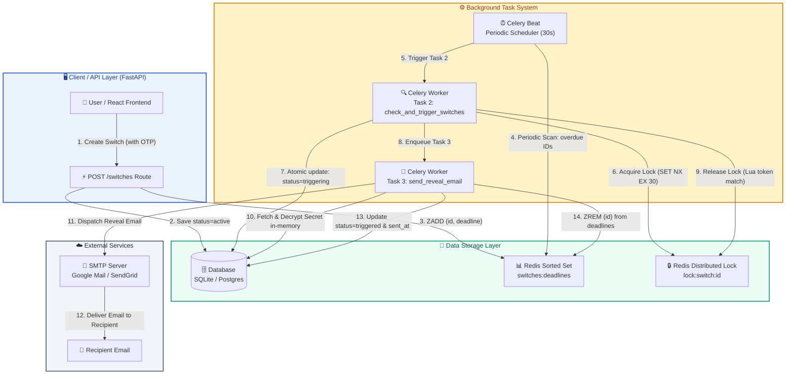
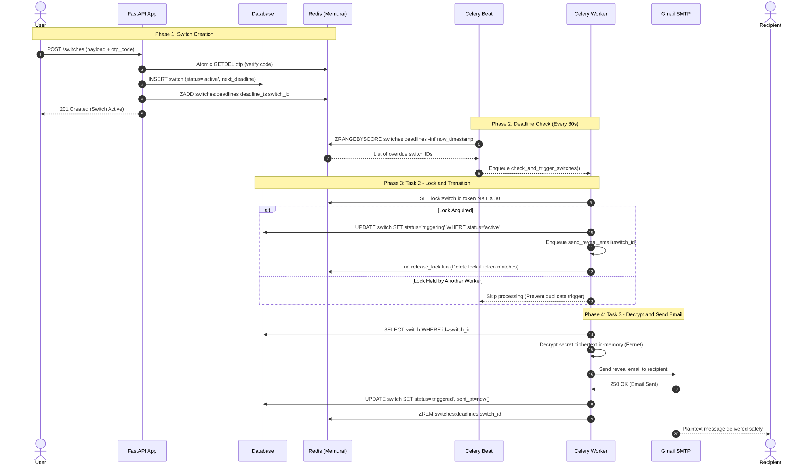
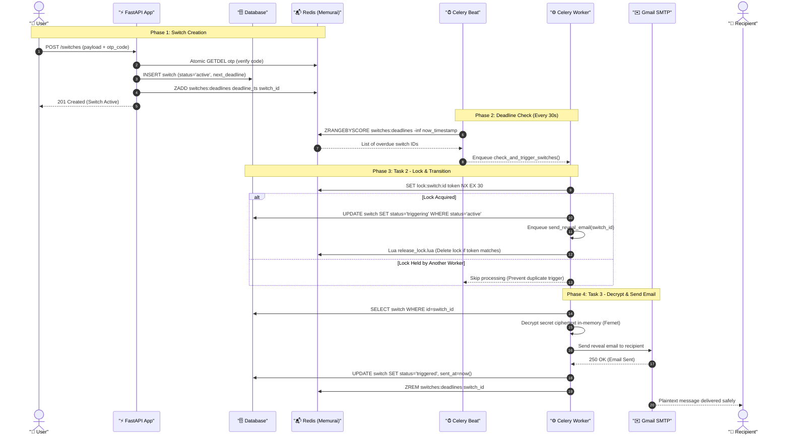
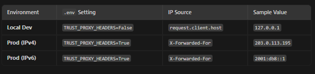
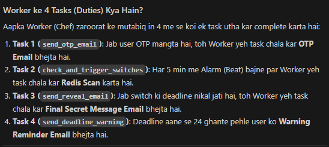
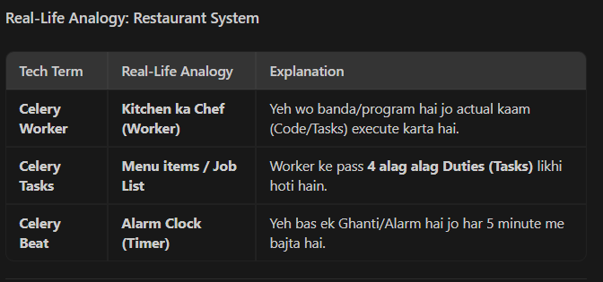

# Background Worker & Task Architecture

This document visualizes how FastAPI, Redis, Celery Beat, and Celery Worker interact to manage and trigger Dead Man's Switches automatically.

---

## 1. End-to-End Architecture Flowchart




<details>
<summary><b>View Mermaid Source Code</b></summary>



</details>

---

## 2. Request-Response Sequence Diagram (Lifecycle Execution)




<details>
<summary><b>View Mermaid Source Code</b></summary>



</details>

---

## 3. Detailed 4-Phase Architecture Flowchart

```mermaid
flowchart TD
  subgraph P1["1️⃣  Phase 1: Purpose-Bound OTP Request Flow"]
    direction LR
    U1["👤 User\nClick 'Send OTP' in UI"]
    API1["⚡ POST /otp/request\nFastAPI Endpoint"]
    RL1["⏱️ Rate Limit Check\nUser max 3 · IP max 10"]
    REDIS1["📬 Redis Store\nSET NX otp:hash · 60s cooldown"]
    CEL1["⚙️ Celery send_otp_email\nAsync background task"]
    SMTP1["📨 Gmail SMTP\nDeliver 6-digit code to inbox"]

    U1 -->|"1. Request OTP"| API1
    API1 -->|"2. Check limits"| RL1
    RL1 -->|"3. Save OTP hash"| REDIS1
    API1 -->|"4. Enqueue task"| CEL1
    CEL1 -->|"5. Send email"| SMTP1
    SMTP1 -->|"6. Inbox delivery"| U1
  end

  subgraph P2["2️⃣  Phase 2: Switch Creation & Encryption"]
    direction LR
    U2["👤 User\nSubmit Recipient + Secret + OTP"]
    API2["⚡ POST /switches\nFastAPI Endpoint"]
    V2["🔑 Inlined OTP Verify\nAtomic GETDEL · hmac compare"]
    ENC2["🔐 Fernet Encryption\nIn-memory cipher generation"]
    DB2["🗄️ Database\nINSERT switch status: active"]
    Z2["📊 Redis Sorted Set\nZADD switches:deadlines"]

    U2 -->|"1. Submit form"| API2
    API2 -->|"2. Verify & consume OTP"| V2
    V2 -->|"3. Encrypt payload"| ENC2
    ENC2 -->|"4. Persist row"| DB2
    DB2 -->|"5. Register deadline"| Z2
  end

  subgraph P3["3️⃣  Phase 3: Check-in Deadline Extension"]
    direction LR
    U3["👤 User\nCheck-in with OTP"]
    API3["⚡ POST /switches/id/checkin\nFastAPI Endpoint"]
    DB3["🗄️ Database\nAtomic UPDATE WHERE status=active"]
    Z3["📊 Redis Sorted Set\nZADD new deadline timestamp"]

    U3 -->|"1. Check-in request"| API3
    API3 -->|"2. Extend deadline"| DB3
    DB3 -->|"3. Update score"| Z3
  end

  subgraph P4["4️⃣  Phase 4: Expiry Scan & Automated Secret Reveal"]
    direction LR
    BEAT4["⏰ Celery Beat\nScans every 30 seconds"]
    Z4["📊 Redis Sorted Set\nZRANGEBYSCORE overdue"]
    LOCK4["🔒 Distributed Lock\nSET lock:switch:id NX EX 30"]
    DB4["🗄️ Database\nAtomic UPDATE status: triggering"]
    TASK4["📧 Celery send_reveal_email\nDecrypt in-memory (Fernet)"]
    SMTP4["📨 Gmail SMTP\nPlaintext reveal to recipient"]
    ZREM4["🗑️ Redis Cleanup\nZREM deadline · Release Lock"]

    BEAT4 -->|"1. Scan overdue"| Z4
    Z4 -->|"2. Overdue found"| LOCK4
    LOCK4 -->|"3. Transition status"| DB4
    DB4 -->|"4. Enqueue Task 3"| TASK4
    TASK4 -->|"5. Deliver secret"| SMTP4
    TASK4 -->|"6. Cleanup & release"| ZREM4
  end

  P1 --> P2
  P2 --> P3
  P2 --> P4

  style P1 fill:#EBF3FC,stroke:#1D4ED8,stroke-width:2px,color:#1E3A8A
  style P2 fill:#F3E8FF,stroke:#7E22CE,stroke-width:2px,color:#581C87
  style P3 fill:#ECFDF5,stroke:#059669,stroke-width:2px,color:#065F46
  style P4 fill:#FEF3C7,stroke:#D97706,stroke-width:2px,color:#92400E
```



<details>
<summary><b>View Mermaid Source Code</b></summary>



</details>

---

## 3. Summary of Key Guard Rails

| Layer | Mechanism | Purpose |
| :--- | :--- | :--- |
| **Distributed Lock** | `SET lock:switch:{id} token NX EX 30` | Prevents multiple Celery workers from picking up the same switch concurrently. |
| **Atomic DB Update** | `UPDATE WHERE status='active'` | Race condition guard — ensures only 1 worker transitions switch status. |
| **Double Guard on Send** | Check `status == 'triggering'` & `sent_at IS NULL` | Prevents duplicate email sends on Celery retries. |
| **In-Memory Decryption** | Decrypted secret never written to disk/broker | Plaintext secret is never logged or stored anywhere in plaintext. |








---

## Production OTP Architecture

- **Generation**: Use Python's built-in `secrets` module (not `random`) to generate a cryptographically strong 4-to-6 digit numeric code. [[1](https://www.tutorialspoint.com/cryptography/one_time_password_algorithm_in_cryptography.htm)]
- **Storage**: Store the OTP in an in-memory data store like Redis mapped to the user's phone number or email, applying a short expiration time (e.g., 3 to 5 minutes). [[1](https://www.youtube.com/watch?v=LNZm6QJHvTo)]
- **Delivery**: Offload SMS or email sending to a reliable third-party provider (such as Twilio, SendGrid, or AWS SES) asynchronously using background tasks or Celery so it doesn't block the FastAPI event loop.
- **Verification & Cleanup**: Once verified, immediately delete the OTP key from Redis to prevent replay attacks.

---

## Core Production Best Practices

- **Rate Limiting**: Protect your `/send-otp` and `/verify-otp` endpoints using rate-limiting libraries (like slowapi) to stop brute-force code guessing and SMS spam.
- **Attempt Tracking**: Keep a counter in Redis for failed verification attempts (e.g., lock out the user after 3 consecutive wrong guesses).
- **Idempotency / Cooldown**: Enforce a cooldown period (e.g., 60 seconds) before a user can request a resend of a new OTP code.
- **Audit Logs**: Log failed and successful verification attempts with IP addresses for security monitoring. [[1](https://www.scalekit.com/blog/fastapi-passwordless-magic-link-otp-implementation)], [[2](https://medium.com/@Smyekh/fastapi-for-frontend-developers-a-simple-api-tutorial-with-twilio-otp-authentication-23cef1a2c1b4)]


---

### Redis Key Table
| Key | TTL | Purpose |
|---|---|---|
| `oauth:state:{state}` | 5 min | CSRF token for OAuth |
| `otp:{user_id}:{purpose}` | 5 min | Live OTP hash (`sha256(code + user_id + purpose)`) |
| `rl:login:ip:{ip}` | 60 sec (1 min) | **1 login / 1 min per IP limit** |
| `rl:otpreq:user:{id}:{purpose}` | 10 min | OTP request rate limit (max 3/10m) |
| `rl:otpreq:ip:{ip}:{purpose}` | 10 min | OTP request IP limit (max 10/10m) |
| `rl:otpver:user:{id}` | 10 min | OTP verify attempt limit (max 5/10m) |
| `rl:otpver:ip:{ip}` | 10 min | OTP verify IP limit (max 20/10m) |
| `switches:deadlines` | none | Sorted set: score = deadline timestamp |
| `lock:switch:{id}` | 30 sec | Per-switch distributed lock |
| `warning:sent:{switch_id}` | 24 hours | 24h deadline warning idempotency guard (Task 4) |
| `refresh:{hash}` | 30 days | Hashed refresh token |

### Sorted Set Rebuild 
Memurai doesn't persist across restarts. On worker startup, `worker_ready` signal calls `rebuild_deadline_sorted_set()` which re-seeds the sorted set from DB (source of truth). Without this, Beat would find no candidates and switches silently never trigger.

---


---

## OTP Requests & Purpose Usage Guide

All actions (Creating, Checking-in, or Cancelling a switch) require a purpose-bound OTP code. Request OTPs via `POST /otp/request`.

### 1. Request OTP to Create a Switch
Used before calling `POST /switches`.
```json
{
  "purpose": "create_switch",
  "resend": false
}
```
**Then Call `POST /switches` Body:**
```json
{
  "recipient_email": "iamkabshah@gmail.com",
  "interval_hours": 1,
  "secret_message": "water is blue and black",
  "otp_code": "YOUR_6_DIGIT_OTP"
}
```

### 2. Request OTP to Check-in (Extend Deadline)
Used before calling `POST /switches/{switch_id}/checkin` (replace `{switch_id}` with target switch ID, e.g. `1`).
```json
{
  "purpose": "checkin:1",
  "resend": false
}
```
**Then Call `POST /switches/1/checkin` Body:**
```json
{
  "otp_code": "YOUR_6_DIGIT_OTP"
}
```

### 3. Request OTP to Cancel a Switch
Used before calling `POST /switches/{switch_id}/cancel` (replace `{switch_id}` with target switch ID, e.g. `2`).
```json
{
  "purpose": "cancel:2",
  "resend": false
}
```
**Then Call `POST /switches/2/cancel` Body:**
```json
{
  "otp_code": "YOUR_6_DIGIT_OTP"
}
```

> **Note on Resending**: Set `"resend": true` in any request body if an OTP is already pending and you want to instantly invalidate it and receive a fresh OTP code via email.

---

## Background Jobs (Celery Tasks)

The system runs 4 core asynchronous background jobs:

### 1. `check_and_trigger_switches` (Periodic Trigger Scanner — Task 2)
- **File**: [`app/tasks/beat_tasks.py`](file:///e:/dead%20switch/app/tasks/beat_tasks.py)
- **Schedule**: Every **5 minutes** (via Celery Beat).
- **Function**: Scans Redis sorted set (`switches:deadlines`) & SQLite DB for overdue switches. If a switch's deadline has passed without a check-in, it atomically acquires a distributed lock (`lock:switch:{id}`), transitions status `active` → `triggering`, and dispatches Task 3 (`send_reveal_email`).

### 2. `send_otp_email` (OTP Delivery Task — Task 1)
- **File**: [`app/tasks/email_tasks.py`](file:///e:/dead%20switch/app/tasks/email_tasks.py)
- **Trigger**: Called asynchronously on `POST /otp/request`.
- **Function**: Dispatches 6-digit purpose-bound OTP codes to the user's registered Gmail address via SMTP.

### 3. `send_reveal_email` (Secret Reveal Task — Task 3)
- **File**: [`app/tasks/email_tasks.py`](file:///e:/dead%20switch/app/tasks/email_tasks.py)
- **Trigger**: Dispatched when a switch's deadline expires and transitions to `triggering`.
- **Function**: In-memory Fernet decryption of `secret_ciphertext` (plaintext is never sent over Redis broker) and sends the unencrypted secret to `recipient_email`. Transitions status to `triggered` upon success or `failed_reveal` upon permanent failure.

### 4. `send_deadline_warning` / `check_and_warn_switches` (Deadline Warning Task — Task 4)
- **Files**: [`app/tasks/beat_tasks.py`](file:///e:/dead%20switch/app/tasks/beat_tasks.py) & [`app/tasks/email_tasks.py`](file:///e:/dead%20switch/app/tasks/email_tasks.py)
- **Schedule / Trigger**: Celery Beat runs `check_and_warn_switches` scanner every **5 minutes**. When an active switch's deadline is within **24 hours**, it enqueues `send_deadline_warning`.
- **Function**: Sends an alert email to the switch owner reminding them to check in before their secret is released.
- **Idempotency Guard**: Protected by Redis `warning:sent:{switch_id}` with `SET NX EX 86400` (24-hour TTL) so the owner receives exactly **one** warning per cycle even though the Beat scanner checks every 5 minutes.

---